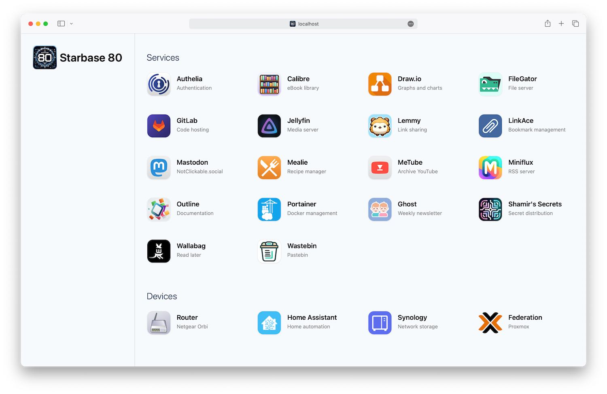
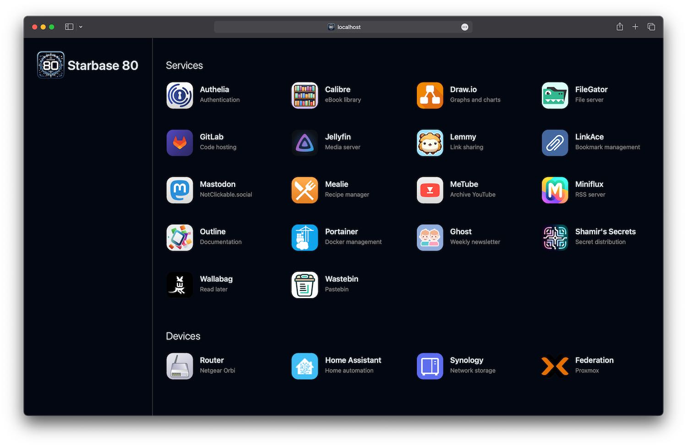

# Starbase 80

> DR T'ANA: (to Mariner) "You wanna goof around, go work on Starbase 80!"<br />
> JET: "Damn, Starbase 80?!"

# About

A nice looking homepage for Docker containers or any services and links.

No actual integration with Docker. Loads instantly. Dark mode follows your OS.

If you make a change to the config JSON, restart this container and refresh.

Inspired by [Ben Phelps' Homepage](https://gethomepage.dev/) and [Umbrel](https://umbrel.com/). Dedicated to [Star Trek: Lower Decks](https://www.paramountplus.com/shows/star-trek-lower-decks/).

# Docker and source code

- [Docker image](https://hub.docker.com/r/jordanroher/starbase-80)
- [Source code on GitHub](https://github.com/notclickable-jordan/starbase-80)

# Live demo

- [Starbase 80](https://notclickable-jordan.github.io/starbase-80/)

# Preview



<br />



# Docker

## Sample Docker compose

```yaml
services:
    starbase80:
        image: jordanroher/starbase-80
        ports:
            - 80:4173
        environment:
            - TITLE=Starbase 80
            - LOGO=/starbase80.jpg
        volumes:
            - ./config.json:/app/src/config/config.json
            - ./public/favicon.ico:/app/public/favicon.ico
            - ./public/logo.png:/app/public/logo.png
            - ./public/icons:/app/public/icons
```

## Environment variables

| Variable                 | Required | Default                | Notes                                                                                                                            |
| ------------------------ | -------- | ---------------------- | -------------------------------------------------------------------------------------------------------------------------------- |
| TITLE                    | True     | My Website             | Set to TITLE= to hide the title                                                                                                  |
| LOGO                     | True     | /logo.png              | Set to LOGO= to hide the logo                                                                                                    |
| HEADER                   |          | true                   | Set to false to hide the title and logo                                                                                          |
| HEADERLINE               |          | true                   | Set to false to turn off the header border line                                                                                  |
| CATEGORIES               |          | normal                 | Set to "small" for smaller, uppercase category labels                                                                            |
| BGCOLOR                  |          | theme(colors.slate.50) | Page background color in light mode. Set to any hex color or Tailwind color using the theme syntax.                              |
| BGCOLORDARK              |          | theme(colors.gray.950) | Page background color in dark mode. Set to any hex color or Tailwind color using the theme syntax.                               |
| CATEGORYBUBBLECOLORLIGHT |          | theme(colors.white)    | Background color for category bubbles (if enabled) in light mode. Set to any hex color or Tailwind color using the theme syntax. |
| CATEGORYBUBBLECOLORDARK  |          | theme(colors.black)    | Background color for category bubbles (if enabled) in dark mode. Set to any hex color or Tailwind color using the theme syntax.  |
| NEWWINDOW                |          | true                   | Set to false to not have links open in a new window                                                                              |
| THEME                    |          | auto                   | Set to "auto", "light", or "dark" to force a display mode (e.g. dark mode)                                                       |
| HOVER                    |          | none                   | Set to "underline" for an underline effect on titles when hovering/focusing on that service                                      |

## Volumes (bind mounts)

| Path                        | Required | Notes                                                                         |
| --------------------------- | -------- | ----------------------------------------------------------------------------- |
| /app/src/config/config.json | true     | Configuration with list of sites and links                                    |
| /app/public/favicon.ico     |          | Website favicon                                                               |
| /app/public/logo.png        |          | Logo in the header                                                            |
| /app/public/icons           |          | Or wherever you want to put them, JSON icon paths are relative to /app/public |

# Configuration

## Sample config.json

```json
[
	{
		"category": "Services",
		"services": [
			{
				"name": "Archivebox",
				"uri": "https://archivebox.mywebsite.com",
				"description": "Backup webpages",
				"icon": "/icons/archivebox.jpg"
			},
			{
				"name": "Authelia",
				"uri": "https://auth.mywebsite.com",
				"description": "Authentication",
				"icon": "selfhst-authelia"
			},
			{
				"name": "Calibre",
				"uri": "https://calibre.mywebsite.com",
				"description": "eBook library",
				"icon": "/icons/calibre.png"
			}
		]
	},
	{
		"category": "Devices",
		"bubble": true,
		"services": [
			{
				"name": "Router",
				"uri": "http://192.168.1.1/",
				"description": "Netgear Orbi",
				"icon": "/icons/router.png"
			},
			{
				"name": "Home Assistant",
				"uri": "http://homeassistant.local:8123/",
				"description": "Home automation",
				"icon": "home-assistant",
				"iconBubble": false
			},
			{
				"name": "Synology",
				"uri": "http://synology:5000",
				"description": "Network storage",
				"icon": "/icons/synology.png"
			}
		]
	}
]
```

## Category variables

| Name              | Default | Required | Notes                                                                                                                                                     |
| ----------------- | ------- | -------- | --------------------------------------------------------------------------------------------------------------------------------------------------------- |
| category          |         |          | Displays above the list of services                                                                                                                       |
| bubble            | false   |          | Shows a bubble around category                                                                                                                            |
| bubbleBGLight     |         |          | Background color for category bubbles. Must be a [Tailwind color](https://tailwindcss.com/docs/background-color) (do not prefix with `bg-`).              |
| bubbleBGDark      |         |          | Background color for category bubbles in dark mode. Must be a [Tailwind color](https://tailwindcss.com/docs/background-color) (do not prefix with `bg-`). |
| iconBubblePadding | false   |          | If `true`, adds a slight padding around each service's icons which are in a bubble.                                                                       |
| services          |         | true     | Array of services                                                                                                                                         |

## Service variables

| Name              | Default | Required | Notes                                                                                                                                                                                                                                                         |
| ----------------- | ------- | -------- | ------------------------------------------------------------------------------------------------------------------------------------------------------------------------------------------------------------------------------------------------------------- |
| name              |         | true     | Title of service                                                                                                                                                                                                                                              |
| uri               |         | true     | Hyperlink to resource                                                                                                                                                                                                                                         |
| description       |         |          | 2-3 words which appear below the title                                                                                                                                                                                                                        |
| icon              |         |          | Relative URI, absolute URI, service name ([Dashboard icon](https://github.com/walkxcode/dashboard-icons)), `mdi-` service name ([Material Design icon](https://icon-sets.iconify.design/mdi/)), `selfhst-` icon name [selfh.st icon](https://selfh.st/icons/) |
| iconBG            |         |          | Background color for icons. Hex code or [Tailwind color](https://tailwindcss.com/docs/background-color) (do not prefix with `bg-`).                                                                                                                           |
| iconColor         |         |          | Only used as the fill color for Material Design icons. Hex code or [Tailwind color](https://tailwindcss.com/docs/background-color) (do not prefix with `bg-`).                                                                                                |
| iconBubble        | true    |          | If `false` the bubble and shadow are removed from the icon                                                                                                                                                                                                    |
| iconBubblePadding | false   |          | Overrides `bubblePadding` set at the category level                                                                                                                                                                                                           |
| iconAspect        | square  |          | Set to `"width"` or `"height"` to constrain the icon to the width or height of the icon, respectively                                                                                                                                                         |
| newWindow         |         |          | Set to `true` or `false` to override the environment variable `NEWWINDOW` for this service                                                                                                                                                                    |

# Icons

## Volume / bind mount

Create a volume or bind mount to a subfolder of `/app/public` and specify a relative path.

```bash
# Your folder
compose.yml
- icons
  - jellyfin.jpg
  - ghost.jpg
  - etc

# Bind mount
./icons:/app/public/icons

# Icon in config.json
"icon": "/icons/jellyfin.jpg"
```

## Dashboard icons

Use [Dashboard icons](https://github.com/walkxcode/dashboard-icons) by specifying a name without any prefix.

```bash
# Icon in config.json
"icon": "jellyfin"
```

## Material design

Use any [Material Design icon](https://icon-sets.iconify.design/mdi/) by prefixing the name with `mdi-`.

Fill the icon by providing an "iconColor."

Use "black" or "white" for those colors.

```bash
# Icon in config.json
"icon": "mdi-cloud",
"iconColor": "black"
```

## Selfh.st icons

Use any [selfh.st icon](https://selfh.st/icons/) by prefixing the name with `selfhst-`.

```bash
# Icon in config.json
"icon": "selfhst-couchdb"
```

# Change history

## 1.6.4

- Added forced light theme option

## 1.6.3

- Fixed faster shutdown on Docker container

## 1.6.2

- Faster shutdown on Docker container

## 1.6.1

- Added `iconBubblePadding` boolean option to categories and services

## 1.6.0

- Added `CATEGORYBUBBLECOLORLIGHT` and `CATEGORYBUBBLECOLORDARK` for greater control of category bubble colors
- Added `category.bubbleBGLight` and `category.bubbleBGDark` to theme individual category bubble background colors

## 1.5.5

- Updated to node:23-slim

## 1.5.4

- Re-added wget to allow for health checks

## 1.5.3

- Added support for [selfh.st](https://selfh.st/icons/) icons

## 1.5.2

- Fixed issue with Material icons having incorrect left margin
- Fixed aspect ratio issues on images

## 1.5.1

- Changed links to be on the entire service object
- Added underline option

## 1.5.0

- Fixed dark mode manual override

## 1.4.2

- Added `apple-touch-icon-precomposed` link

## 1.4.0

- Rewrote the entire application to not use React. Now it's just a Node application that emits static HTML.
- Removed lots of packages

## 1.3.0

- Removed all JavaScript as part of the build step. The image will be slightly larger and take longer to start up and shut down, but the page will be even lighter.

## 1.2.0

- Moved `config.json` bind mount destination to `/app/src/config/config.json` for improved Portainer and volume support. The previous bind mount location will continue to work, but we recommend updating your bind mounts.
