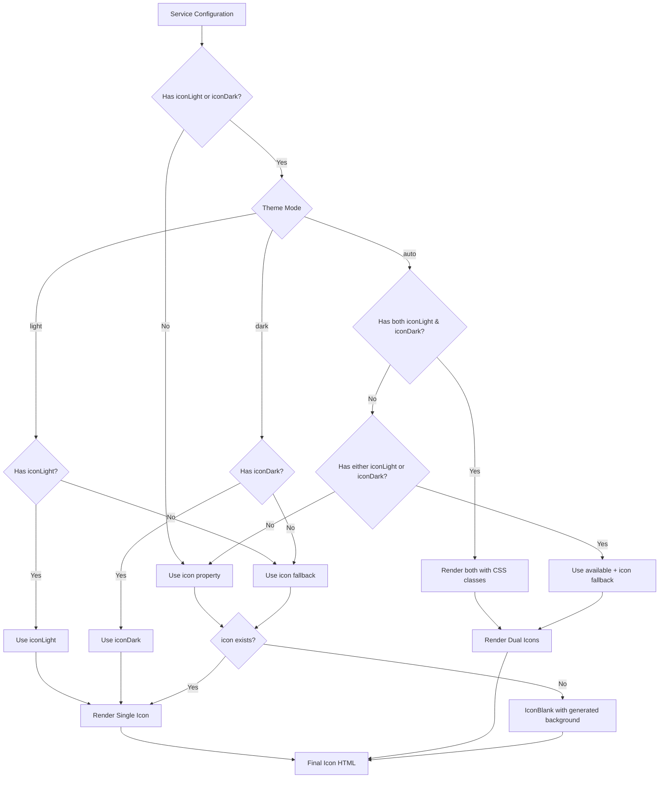
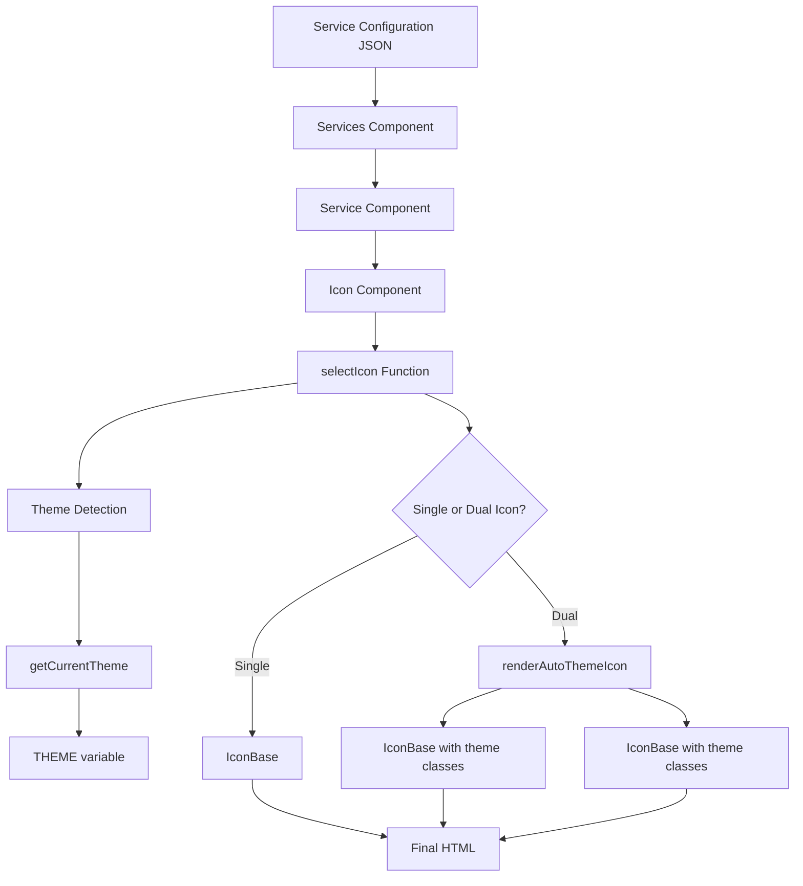

# Theme-Aware Icons Implementation Plan

## Overview

This document outlines the complete implementation plan for adding theme-aware icons (`iconLight` and `iconDark`) to the Starbase-80 service system. The implementation maintains full backward compatibility while extending the existing icon system with theme-specific capabilities.

## Current State Analysis

### Theme System

- **Theme Configuration**: Controlled via `THEME` environment variable with values: `"auto"` (default), `"light"`, `"dark"`
- **Theme Application**: Docker entrypoint modifies `tailwind.config.js` and `index.html` at build time
    - `"auto"`: Uses `darkMode: "media"` (system preference)
    - `"light"`: Uses `darkMode: "selector"` with `class="light"`
    - `"dark"`: Uses `darkMode: "selector"` with `class="dark"`
- **Theme Access**: Currently handled via Tailwind's `dark:` prefix in CSS classes

### Current Icon System

- **Single Icon Property**: [`IService.icon?`](src/shared/types.ts:15)
- **Icon Types Supported**:
    - URI/URL (`http://...` or `/...`)
    - Dashboard Icons (`github`, `docker`, etc.)
    - Self-hosted Icons (`selfhst-...`)
    - Material Design Icons (`mdi-...`)
- **Fallback**: [`IconBlank`](src/components/icon.ts:85) with auto-generated background colors

### Theme-Aware Precedent

Categories already support theme-aware backgrounds:

- [`bubbleBGLight?`](src/shared/types.ts:4) and [`bubbleBGDark?`](src/shared/types.ts:5)
- Implementation in [`service-catalogs.ts`](src/components/service-catalogs.ts:44-50)

## Implementation Plan

### 1. Type System Updates

#### A. Extend IService Interface

**File**: [`src/shared/types.ts`](src/shared/types.ts)

```typescript
export interface IService {
	name: string;
	uri: string;

	description?: string;
	icon?: string; // Existing - fallback icon
	iconLight?: string; // NEW - light theme specific icon
	iconDark?: string; // NEW - dark theme specific icon
	iconColor?: string;
	iconBG?: string;
	iconBubble?: boolean;
	iconBubblePadding?: boolean;
	iconAspect?: IconAspect;

	newWindow?: boolean;
}
```

#### B. Update Icon Component Props

**File**: [`src/components/icon.ts`](src/components/icon.ts)

```typescript
interface IProps {
	name: string;
	index: number;
	icon?: string;
	iconLight?: string; // NEW
	iconDark?: string; // NEW
	iconColor?: string;
	iconBG?: string;
	iconBubble?: boolean;
	iconBubblePadding?: boolean;
	iconAspect?: IconAspect;
	uri?: string;
	newWindow?: boolean;
	categoryBubblePadding?: boolean;
}
```

### 2. Theme Detection Mechanism

#### A. Theme Access Strategy

Since theme configuration happens at build time through Docker entrypoint, we need to make the theme value accessible to TypeScript components.

**Option 1: Export THEME from variables.ts (Recommended)**

**File**: [`src/variables.ts`](src/variables.ts)

```typescript
export const PAGETITLE = "My Website";
export const PAGEICON = "/logo.png";
export const SHOWHEADER = true;
export const SHOWHEADERLINE = true;
export const SHOWHEADERTOP = false;
export const CATEGORIES = "normal";
export const THEME = "auto"; // This gets replaced by docker-entrypoint.sh
export const NEWWINDOW = true;
```

**Update Docker Entrypoint**: [`docker-entrypoint.sh`](docker-entrypoint.sh:32)

```bash
# Add theme replacement (after line 33)
sed -i -e 's/THEME = "auto"/THEME = "'"${THEME}"'"/g' /app/src/variables.ts
```

#### B. Theme Detection Utility

**New File**: `src/shared/theme.ts`

```typescript
import { THEME } from "../variables";

export type Theme = "light" | "dark" | "auto";

export function getCurrentTheme(): Theme {
	return THEME as Theme;
}

export function shouldUseDarkTheme(): boolean {
	const theme = getCurrentTheme();

	switch (theme) {
		case "dark":
			return true;
		case "light":
			return false;
		case "auto":
		default:
			// For 'auto', we rely on CSS media queries at runtime
			// This is a server-side decision, so we return false as default
			return false;
	}
}

export function shouldUseLightTheme(): boolean {
	const theme = getCurrentTheme();

	switch (theme) {
		case "light":
			return true;
		case "dark":
			return false;
		case "auto":
		default:
			// For 'auto', we rely on CSS media queries at runtime
			// This is a server-side decision, so we return true as default
			return true;
	}
}
```

### 3. Icon Selection Logic

#### A. Icon Selection Priority Chain

The icon selection follows this priority order:

1. **Theme-Specific Icon** (when theme is explicit)
    - `THEME="dark"` → `iconDark` (if available)
    - `THEME="light"` → `iconLight` (if available)

2. **Dual Icon Approach for Auto Theme** (when `THEME="auto"`)
    - Generate both light and dark versions using CSS
    - Use CSS `dark:` classes to hide/show appropriate version

3. **Fallback to Generic Icon**
    - Use `icon` property if theme-specific not available

4. **Final Fallback**
    - Use [`IconBlank`](src/components/icon.ts:85) with generated background

#### B. Icon Selection Function

**File**: [`src/components/icon.ts`](src/components/icon.ts)

```typescript
import { getCurrentTheme, shouldUseDarkTheme } from "../shared/theme";

interface IconSelection {
	primary: string | null;
	secondary?: string | null; // For auto theme
	useAutoTheme: boolean;
}

function selectIcon(icon?: string, iconLight?: string, iconDark?: string): IconSelection {
	const theme = getCurrentTheme();

	switch (theme) {
		case "dark":
			return {
				primary: iconDark || icon || null,
				useAutoTheme: false,
			};

		case "light":
			return {
				primary: iconLight || icon || null,
				useAutoTheme: false,
			};

		case "auto":
		default:
			// For auto theme, we need to handle both cases
			if (iconLight && iconDark) {
				// Both theme-specific icons available
				return {
					primary: iconLight,
					secondary: iconDark,
					useAutoTheme: true,
				};
			} else if (iconLight || iconDark) {
				// Only one theme-specific icon available
				const availableIcon = iconLight || iconDark;
				return {
					primary: availableIcon,
					secondary: icon,
					useAutoTheme: true,
				};
			} else {
				// No theme-specific icons, use generic
				return {
					primary: icon || null,
					useAutoTheme: false,
				};
			}
	}
}
```

### 4. Component Updates

#### A. Icon Component Modifications

**File**: [`src/components/icon.ts`](src/components/icon.ts)

Key changes to the [`Icon`](src/components/icon.ts:40) function:

```typescript
export const Icon = function (props: IProps): string {
	const {
		name,
		uri,
		icon,
		iconLight, // NEW
		iconDark, // NEW
		index,
		iconBG,
		iconBubble,
		iconBubblePadding,
		iconColor,
		iconAspect,
		newWindow,
		categoryBubblePadding,
	} = props;

	const iconSelection = selectIcon(icon, iconLight, iconDark);

	if (!iconSelection.primary) {
		if (!is.null(uri)) {
			return Anchor({
				uri: uri as string,
				title: name,
				newWindow,
				children: IconBlank({ index }),
			});
		}
		return IconBlank({ index });
	}

	if (iconSelection.useAutoTheme && iconSelection.secondary) {
		// Render both icons with theme-specific visibility
		return renderAutoThemeIcon(iconSelection, props);
	}

	// Render single icon (theme is explicit or no theme-specific icons)
	let bubblePadding = categoryBubblePadding || false;

	if (iconBubblePadding === true) {
		bubblePadding = true;
	} else if (iconBubblePadding === false) {
		bubblePadding = false;
	}

	return IconBase({
		icon: iconSelection.primary,
		iconBG,
		iconColor,
		iconBubble,
		iconBubblePadding: bubblePadding,
		iconAspect,
	});
};
```

#### B. Auto Theme Icon Rendering

```typescript
function renderAutoThemeIcon(iconSelection: IconSelection, props: IProps): string {
	const { iconBG, iconColor, iconBubble, iconBubblePadding, iconAspect, categoryBubblePadding } = props;

	let bubblePadding = categoryBubblePadding || false;

	if (iconBubblePadding === true) {
		bubblePadding = true;
	} else if (iconBubblePadding === false) {
		bubblePadding = false;
	}

	const lightIcon = IconBase({
		icon: iconSelection.primary!,
		iconBG,
		iconColor,
		iconBubble,
		iconBubblePadding: bubblePadding,
		iconAspect,
		themeClass: "dark:hidden", // NEW: Hide in dark mode
	});

	const darkIcon = IconBase({
		icon: iconSelection.secondary!,
		iconBG,
		iconColor,
		iconBubble,
		iconBubblePadding: bubblePadding,
		iconAspect,
		themeClass: "hidden dark:block", // NEW: Show only in dark mode
	});

	return `${lightIcon}${darkIcon}`;
}
```

#### C. IconBase Updates

Update [`IconBase`](src/components/icon.ts:110) function to support theme classes:

```typescript
interface IIconBaseProps {
	icon: string;
	iconColor?: string;
	iconBG?: string;
	iconBubble?: boolean;
	iconBubblePadding?: boolean;
	iconAspect?: IconAspect;
	themeClass?: string; // NEW
}

function IconBase(props: IIconBaseProps) {
	let { icon, iconBG, iconBubble, iconBubblePadding, iconColor, iconAspect = "square", themeClass } = props;

	// ... existing logic ...

	let bubbleClassName = "flex items-center justify-center overflow-hidden bg-contain";

	// Add theme class if provided
	if (themeClass) {
		bubbleClassName += ` ${themeClass}`;
	}

	// ... rest of existing logic ...
}
```

#### D. Services Component Updates

**File**: [`src/components/services.ts`](src/components/services.ts)

Update the [`Service`](src/components/services.ts:27) function:

```typescript
function Service(props: IServiceProps) {
	const { service, index, categoryBubblePadding } = props;

	const {
		name,
		uri,
		description,
		icon,
		iconLight, // NEW
		iconDark, // NEW
		iconBG,
		iconBubble,
		iconBubblePadding,
		iconColor,
		iconAspect,
		newWindow,
	} = service;

	return `
        <li class="p-4">
        ${Anchor({
			uri,
			newWindow,
			className: "flex gap-4",
			children: `${
				!is.null(icon) || !is.null(iconLight) || !is.null(iconDark) // UPDATED
					? `<span class="flex-shrink-0 flex">${Icon({
							name,
							icon,
							iconLight, // NEW
							iconDark, // NEW
							uri,
							index,
							iconColor,
							iconBG,
							iconBubble,
							iconAspect,
							newWindow,
							categoryBubblePadding,
							iconBubblePadding,
						})}</span>`
					: ``
			}
        <div>
            <h3 class="text-lg mt-1 font-semibold line-clamp-1">${name}</h3>
            ${!is.null(description) ? `<p class="text-sm text-black/50 dark:text-white/50 line-clamp-1">${description}</p>` : ``}
        </div>`,
		})}
        </li>
    `;
}
```

### 5. API Design & Usage Patterns

#### A. Service Configuration Examples

**Basic Usage** (backward compatible):

```json
{
	"name": "GitHub",
	"uri": "https://github.com",
	"icon": "github"
}
```

**Theme-Specific Icons**:

```json
{
	"name": "My App",
	"uri": "https://myapp.example.com",
	"icon": "default-logo.png",
	"iconLight": "logo-for-light-theme.png",
	"iconDark": "logo-for-dark-theme.svg"
}
```

**Mixed Icon Types**:

```json
{
	"name": "Dashboard Service",
	"uri": "https://service.example.com",
	"iconLight": "mdi-chart-line",
	"iconDark": "https://cdn.example.com/dark-chart-icon.svg"
}
```

**Only One Theme Icon** (falls back to generic):

```json
{
	"name": "Special Service",
	"uri": "https://special.example.com",
	"icon": "generic-icon.png",
	"iconDark": "special-dark-icon.svg"
}
```

#### B. Icon Priority Resolution Examples

| Configuration                                    | THEME="light" | THEME="dark" | THEME="auto"                 |
| ------------------------------------------------ | ------------- | ------------ | ---------------------------- |
| `icon: "base.png"`                               | base.png      | base.png     | base.png                     |
| `icon: "base.png"`, `iconLight: "light.png"`     | light.png     | base.png     | light.png (+ fallback CSS)   |
| `icon: "base.png"`, `iconDark: "dark.png"`       | base.png      | dark.png     | base.png + dark.png (CSS)    |
| `iconLight: "light.png"`, `iconDark: "dark.png"` | light.png     | dark.png     | Both (CSS toggle)            |
| `iconLight: "light.png"` only                    | light.png     | IconBlank    | light.png (CSS: show always) |

### 6. Backward Compatibility Strategy

#### A. Compatibility Guarantees

1. **Existing Configurations**: All current service configurations continue to work unchanged
2. **Fallback Behavior**: When theme-specific icons aren't available, falls back to existing `icon` property
3. **Type Safety**: New properties are optional (`iconLight?`, `iconDark?`)
4. **Build Process**: No changes to existing Docker build process required

#### B. Migration Path

**Phase 1**: Add new properties to types and components (non-breaking)
**Phase 2**: Users can gradually adopt theme-specific icons
**Phase 3**: Future enhancements can build on this foundation

### 7. Testing Strategy

#### A. Unit Tests

**Test File**: `tests/components/icon.test.ts`

Key scenarios to test:

1. **Icon Selection Logic**:

    ```typescript
    describe("selectIcon", () => {
    	test("uses iconDark when theme is dark and available", () => {
    		// Mock THEME = "dark"
    		const result = selectIcon("base.png", "light.png", "dark.png");
    		expect(result.primary).toBe("dark.png");
    		expect(result.useAutoTheme).toBe(false);
    	});

    	test("falls back to icon when theme-specific not available", () => {
    		// Mock THEME = "dark"
    		const result = selectIcon("base.png", "light.png", undefined);
    		expect(result.primary).toBe("base.png");
    	});

    	test("handles auto theme with both icons", () => {
    		// Mock THEME = "auto"
    		const result = selectIcon("base.png", "light.png", "dark.png");
    		expect(result.primary).toBe("light.png");
    		expect(result.secondary).toBe("dark.png");
    		expect(result.useAutoTheme).toBe(true);
    	});
    });
    ```

2. **Component Rendering**:

    ```typescript
    describe("Icon component", () => {
    	test("renders single icon for explicit theme", () => {
    		const html = Icon({
    			name: "Test",
    			index: 0,
    			icon: "base.png",
    			iconDark: "dark.png",
    		});
    		expect(html).toContain("dark.png"); // When THEME=dark
    		expect(html).not.toContain("base.png");
    	});

    	test("renders both icons for auto theme", () => {
    		// Mock THEME = "auto"
    		const html = Icon({
    			name: "Test",
    			index: 0,
    			iconLight: "light.png",
    			iconDark: "dark.png",
    		});
    		expect(html).toContain("light.png");
    		expect(html).toContain("dark.png");
    		expect(html).toContain("dark:hidden");
    		expect(html).toContain("dark:block");
    	});
    });
    ```

3. **Backward Compatibility**:
    ```typescript
    test("maintains backward compatibility with single icon", () => {
    	const html = Icon({
    		name: "Test",
    		index: 0,
    		icon: "legacy.png",
    	});
    	expect(html).toContain("legacy.png");
    });
    ```

#### B. Integration Tests

1. **Theme Configuration**: Test different `THEME` environment variable values
2. **Icon Type Support**: Verify all icon types work with theme-aware properties
3. **CSS Classes**: Validate that correct Tailwind classes are applied
4. **Fallback Behavior**: Test graceful degradation when icons are missing

#### C. Visual Testing Scenarios

1. **Theme Switching**:
    - Light theme shows `iconLight`
    - Dark theme shows `iconDark`
    - Auto theme responds to system preference
2. **Mixed Configurations**:
    - Services with only generic icons
    - Services with only theme-specific icons
    - Services with mixed icon types

3. **Edge Cases**:
    - Missing icon files
    - Invalid icon URLs
    - Very long icon names

### 8. Implementation Checklist

#### Phase 1: Type System & Core Logic

- [ ] Update [`IService`](src/shared/types.ts:10) interface with `iconLight?` and `iconDark?`
- [ ] Create [`src/shared/theme.ts`](src/shared/theme.ts) utility
- [ ] Update [`docker-entrypoint.sh`](docker-entrypoint.sh) to replace THEME in variables.ts
- [ ] Implement icon selection logic in [`src/components/icon.ts`](src/components/icon.ts)

#### Phase 2: Component Updates

- [ ] Update [`Icon`](src/components/icon.ts:40) component props and logic
- [ ] Implement `renderAutoThemeIcon` function
- [ ] Update [`IconBase`](src/components/icon.ts:110) to support theme classes
- [ ] Update [`Service`](src/components/services.ts:27) component to pass new props

#### Phase 3: Testing & Validation

- [ ] Add unit tests for icon selection logic
- [ ] Add component rendering tests
- [ ] Add integration tests for theme switching
- [ ] Test backward compatibility scenarios
- [ ] Validate all icon types work with theme-aware properties

#### Phase 4: Documentation & Examples

- [ ] Update service configuration examples
- [ ] Document API usage patterns
- [ ] Create migration guide for existing configurations
- [ ] Add troubleshooting guide

### 9. Mermaid Architecture Diagrams

#### Icon Selection Flow



#### Component Architecture



### 10. Migration and Rollout Strategy

#### A. Development Process

1. **Feature Branch**: Implement changes in isolated branch
2. **Unit Testing**: Ensure all tests pass
3. **Integration Testing**: Test with various theme configurations
4. **Documentation**: Update README and API docs
5. **Code Review**: Peer review focusing on backward compatibility

#### B. Rollout Plan

1. **Beta Testing**: Deploy to test environment with sample configurations
2. **User Feedback**: Collect feedback on API design and usability
3. **Production Deployment**: Roll out with existing configurations unchanged
4. **User Migration**: Provide examples and support for adopting new features

#### C. Risk Mitigation

1. **Backup Strategy**: Ensure existing configurations continue working
2. **Monitoring**: Watch for increased load or rendering issues
3. **Rollback Plan**: Ability to quickly revert if issues arise
4. **Support**: Documentation and examples for troubleshooting

### 11. Performance Considerations

#### A. Rendering Performance

- **Auto Theme**: Dual icon rendering increases HTML size but improves theme switching speed
- **Icon Caching**: Existing CDN usage (dashboard-icons, selfhst) remains unchanged
- **CSS Classes**: Minimal impact from additional theme classes

#### B. Memory Usage

- **Icon Selection**: Minimal computational overhead
- **Component Props**: Small increase in props passed to components
- **Theme Detection**: Cached theme value prevents repeated checks

#### C. Network Impact

- **Additional Icons**: Users may configure more icons, increasing requests
- **CDN Benefits**: Existing CDN strategy mitigates additional requests
- **Fallback Logic**: Reduces failed requests through better icon selection

### 12. Future Enhancements

This implementation provides a foundation for future theme-aware features:

#### A. Extended Theme Support

- **Custom Themes**: Support for user-defined themes beyond light/dark
- **Seasonal Themes**: Holiday or event-specific icon sets
- **Brand Themes**: Company-specific theming capabilities

#### B. Dynamic Theme Switching

- **Runtime Updates**: JavaScript-based theme switching without rebuild
- **User Preferences**: Per-user theme preferences with localStorage
- **Automatic Switching**: Time-based or location-based theme changes

#### C. Icon Management

- **Icon Validation**: Check icon availability at build time
- **Icon Optimization**: Automatic resizing and format conversion
- **Icon Discovery**: Suggest appropriate icons based on service names

#### D. Advanced Features

- **Icon Animations**: Theme-aware icon transitions
- **Icon Variants**: Multiple icons per theme (hover, active states)
- **Icon Accessibility**: Enhanced alt text and ARIA support

---

## Conclusion

This implementation plan provides a comprehensive approach to adding theme-aware icons while maintaining the existing architecture and ensuring full backward compatibility. The design leverages existing patterns from the category system and integrates seamlessly with the current theme configuration mechanism.

The phased approach allows for careful testing and validation at each step, ensuring a robust and reliable implementation that enhances the user experience without disrupting existing functionality.
